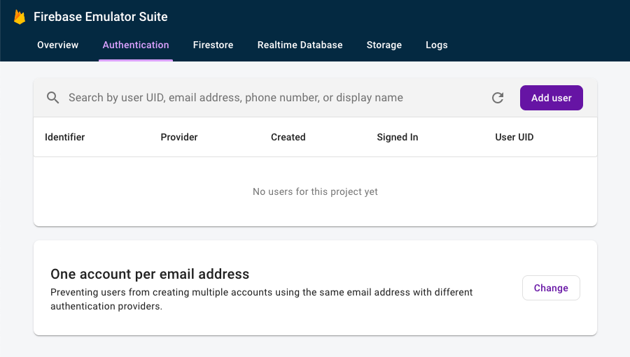
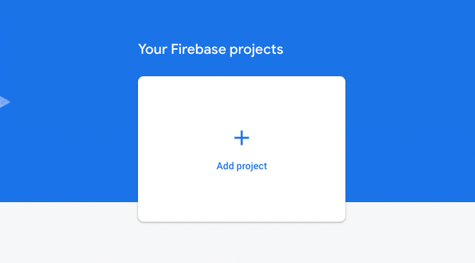
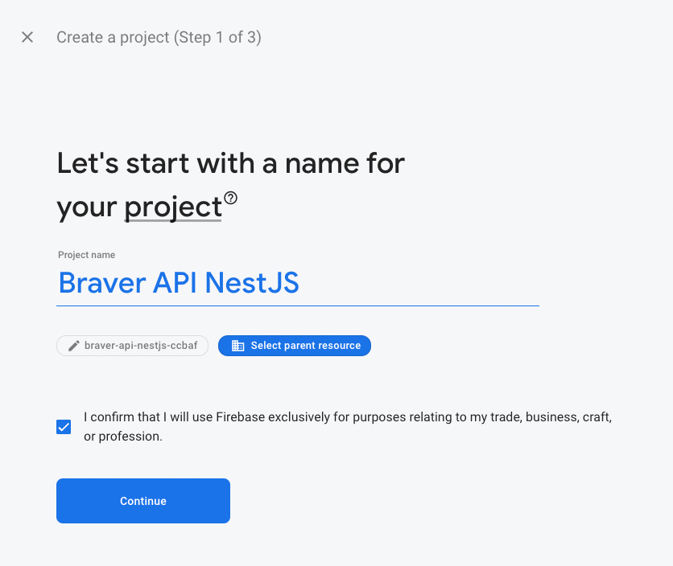
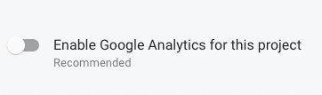
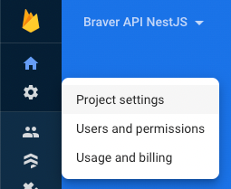
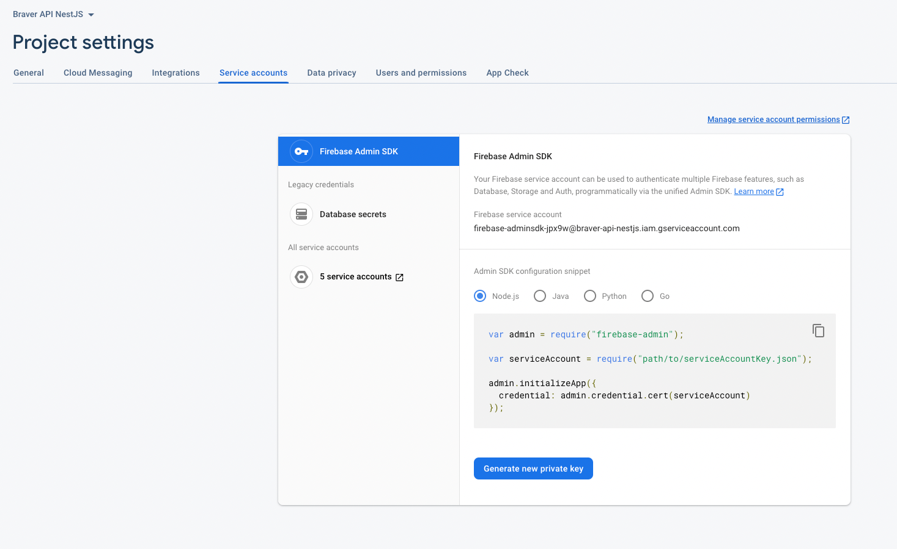
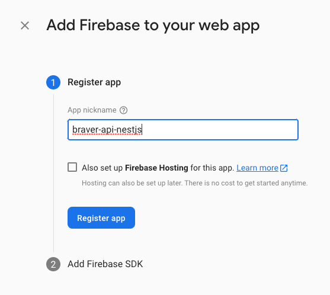
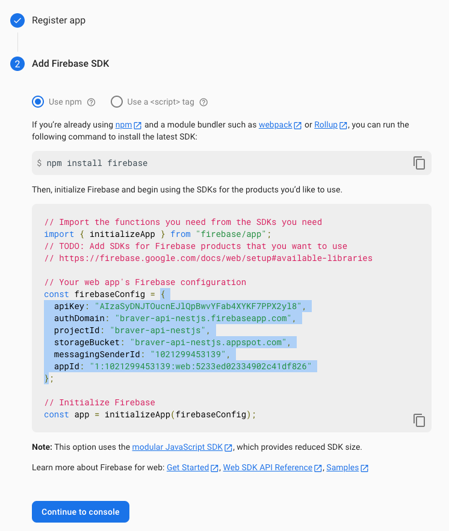
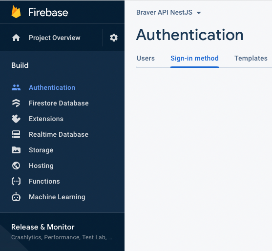

# Firebase

Generic NestJS API uses Firebase Auth for user authentication.
If you are simply trying to setup local Firebase for development, see [Local Development](#local-development).

When a the `register` mutation is called, a "user" is created in firebase corresponding to the details they submitted, and a JWT is generated and signed by firebase. Similarly, a JWT is returned from firebase when the `login` mutation is called.

A few things need to be done to make this work as intended.

## Table of Contents

- [Local Development](#local-development)
  - [Firebase Emulator](#firebase-emulator)
  - [Environment Variables](#environment-variables)
  - [Running the App](#running-the-app)
- [Production: Connecting to Existing Firebase Auth Project](#production-connecting-to-existing-firebase-auth-project)
- [Production: Setup / New Project](#prouction-setup--new-project)
  - [Create a Firebase Project](#create-a-firebase-project)
  - [Download the Admin Credentials](#download-the-admin-credentials)
  - [Add a Web App to the Project](#add-a-web-app-to-the-project)
  - [Enable Firebase Authentication](#enable-firebase-authentication)

## Local Development

### Firebase emulator

The firebase emulator allows you to test things like authentication locally, without affecting the real firebase project data. We will need to install and configure the firebase emulator to make use of this.

**Install firebase tools globally**

```shell
npm i -g firebase-tools
```

**Login to firebase**

Choose the account associated with the firebase project you created and grant the requested permissions.

```shell
firebase login
```

> You can indicate **No** when prompted for _Allow Firebase to collect CLI usage and error reporting information_

**Initialize the emulator**

```shell
firebase init emulators
```

The firebase CLI will ask a series of questions to associate the emulator with a project.

1. If not selected by default, select the braver-api-nestjs (Braver API NestJS) project
1. Choose the authentication emulator from the list of emulators
1. If not specifed by default, use port 9099 for the auth emulator
1. If not enabled by default, enable the emulator UI
1. When prompted to download the emulators, type **Yes**

This will create two files: `firebase.json` and `.firebaserc`. After all that's done, you should be able to run `yarn emulators:start` and navigate to http://localhost:4000/auth to view the emulator UI



### Environment variables

Ensure your `.env` has a `FIREBASE_AUTH_EMULATOR_HOST` entry which matches the `ip-address:port` combination that you've used
for your local emulators to run on.

> If you don't already have a `.env`, copy it from `.env.example`

### Running the app

Now you can run the app locally with `yarn start:dev`

```
[7:35:46 PM] Starting compilation in watch mode...

[7:35:51 PM] Found 0 errors. Watching for file changes.

[2022-35-22T00:04:52.283Z] INFO: [] Starting Nest application...
[2022-35-22T00:04:52.283Z] INFO: [] LoggerModule dependencies initialized
[2022-35-22T00:04:52.283Z] INFO: [] AppModule dependencies initialized
[2022-35-22T00:04:52.283Z] INFO: [] GraphQLSchemaBuilderModule dependencies initialized
[2022-35-22T00:04:52.283Z] INFO: [] GraphQLModule dependencies initialized
[2022-35-22T00:04:52.283Z] INFO: [] AppleController {/}:
[2022-35-22T00:04:52.283Z] INFO: [] Mapped {/apple-app-site-association, GET} route
[2022-35-22T00:04:52.283Z] INFO: [] HealthController {/}:
[2022-35-22T00:04:52.283Z] INFO: [] Mapped {/health, GET} route
[2022-35-22T00:04:52.283Z] INFO: [] Mapped {/graphql, POST} route
[2022-35-22T00:04:52.283Z] INFO: []  {"message":"Starting a postgresql pool with 21 connections.","target":"quaint::pooled"}
[2022-35-22T00:04:52.283Z] INFO: [] Nest application successfully started
[2022-35-22T00:04:52.283Z] INFO: [] server listening on port 3000
```

## Production: Connecting to existing Firebase Auth Project

[CLONE_UPDATE]
If you're working from this repository please update this section with the
necessary details for connecting to your existing Firebase Auth app in the
Firebase console.

- Go to firebase.google.com
  - Click on "Go to Console"
  - Authenticate with credentials: (ask X for them)
  - see "Authentication"

## Prouction: Setup / New Project

If you've cloned this repository for setting up a new project, and you're needing
to prepare the API to be deployed, you'll need to set up a fresh Firebase project.
See the steps below for setup instructions.

### Create a Firebase project

First we need to create a firebase project 🙂

1. Go to [console.firebase.google.com](https://console.firebase.google.com/) and click the _Add project_ button



2. Call it whatever name suits your project (in the case of this API I would pick `Generic NestJS API`) and press continue.



3. No need for Google Analytics. You can leave this toggle unchecked: `Enable Google Analytics for this project`.



4. Click _Create project_.

### Download the admin credentials

1. Inside the project you just created, navigate to _Service accounts_

- Click the Settings 'Cog' Icon (likely top-left in sidebar).
- Navigate to `Project Settings` (via the dropdown from the Cog icon).
- Navigate to `Service Accounts` (one of the tabs in the group that should appear).



2. Click _Generate new private key_ (with Node.js selected)



3. Create your env vars.

- Store the generated file (JSON) in your .env under the key: `GOOGLE_CREDENTIALS`.
  (It's also good to keep a copy of this saved somewhere secure like 1Password).

- Create another .env variable called `GOOGLE_APPLICATION_CREDENTIALS` with the value: "google-credentials.json".

> These credentials are used by the application to verify JWTs attached to incoming requests.
> At runtime, the `google-credentials.json` file should be written to with the information from `GOOGLE_CREDENTIALS`.
> If for whatever reason that doesn't work, you can also manually create the file.

### Add a web app to the project

The API will act as both the admin app (verifying JWTs), and a client app (issuing JWTs). For this, we will need to download and configure client credentials.

1. Navigate to _General_ settings using `Settings cog icon > Project settings > General`, scroll to **Your Apps**, and click the web icon


2. Click **Register app** (the button might say **Add app**), then select the web app icon

3. Call the app something that makes sense for your project (here I'd pick `generic-nestjs-api`)



> No need for Firebase Hosting. You can leave that unchecked.

4. Now click _Register app_ again.

5. Continue with Firebase instructions

- Install `firebase` if you haven't already.

- Copy the `firebaseConfig` json variable into your .env as `FIREBASE_CLIENT_CONFIG`.

> Note that for json to be considered valid in a .env file, it must be all one one line.



### Enable Firebase Authentication

We want firebase to handle user authentication, so we'll need to turn on the modes of authentication in the firebase project that we want it to support.

To do this, go to `Build > Authentication` (in the sidebar)



Click _Get started_, _Email/Password_, then flip the _Enable_ switch to add it as an authentication method.

Next, click the **Add new provider** button, and select Google from the list

> Add a project support email if the dialogue is presented (you could use your MetaLab email address)
